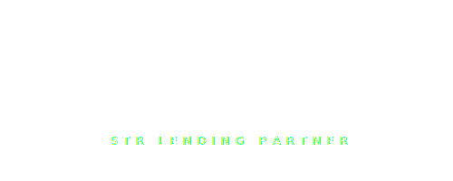

# Rabbu Partner Page — Handoff

Three things to deploy.

## 1. Upload these two files to the site root

Both files drop straight into the root of your repo (same level as `biggerpockets.html` and `BP_Featured-Lender-White_500W.png`):

| File | Destination |
|------|-------------|
| `rabbu.html` | `/rabbu.html` |
| `Rabbu_STR-Lending-Partner-White_500W.svg` | `/Rabbu_STR-Lending-Partner-White_500W.svg` |

Live URL after deploy: `https://goratehero.com/rabbu.html`
Short URL to share: `https://goratehero.com/rabbu` (Cloudflare Pages will serve the `.html` for the extensionless path automatically).

Email `Rabbu@goratehero.com` is surfaced in three spots on that page:
- Hero section ("Rabbu investor? Email us direct: …")
- Final CTA pill ("RABBU LANE · Rabbu@goratehero.com")
- Footer brand column

---

## 2. Patch `index.html` — add the Rabbu badge next to BiggerPockets

**Find this line on the homepage** (it's the only place `BP_Featured-Lender-White_500W.png` appears):

```html
<a href="biggerpockets.html"></a>
```

**Replace the whole `<a>…</a>` with:**

```html
<div class="partner-badges">
  <a href="biggerpockets.html" class="partner-badge">
    
  </a>
  <a href="rabbu.html" class="partner-badge">
    
  </a>
</div>
```

**Then add this CSS anywhere inside the site's `<style>` block** (or in the shared stylesheet if there is one):

```css
.partner-badges {
  display: flex;
  gap: 24px;
  align-items: center;
  justify-content: center;
  flex-wrap: wrap;
  margin: 24px 0;
}
.partner-badge {
  display: inline-block;
  line-height: 0;
  transition: transform .25s ease, opacity .25s ease;
  opacity: 0.92;
}
.partner-badge:hover {
  transform: translateY(-2px);
  opacity: 1;
}
.partner-badge img {
  width: 200px;   /* tune to match current BP badge width on homepage */
  height: auto;
  display: block;
}
@media (max-width: 520px) {
  .partner-badges { gap: 14px; }
  .partner-badge img { width: 150px; }
}
```

Tune the `width: 200px` to whatever the BP badge currently renders at on the homepage — the two badges will stay visually identical in size because the Rabbu SVG was designed to the same 500×200 aspect ratio as `BP_Featured-Lender-White_500W.png`.

---

## 3. Patch `biggerpockets.html` — add the `Biggerpockets@goratehero.com` email

The Rabbu page puts the partner email in three spots. To stay symmetric, add it to the BP page in the same spots.

### 3a. In the hero, right below the CTA row

**Find** the hero CTA pair:

```html
<a ... href="quiz.html">Find My Loan →</a>
<a ... href="tel:7473081635">Call (747) 308-1635</a>
```

**Add, immediately after the CTA wrapper closes:**

```html
<div class="hero-email" style="margin-top:26px;font-size:14px;color:#6B7794;">
  BiggerPockets investor? Email us direct:
  <a href="mailto:Biggerpockets@goratehero.com"
     style="color:#E6EDF7;font-weight:600;border-bottom:1px dashed rgba(255,255,255,0.2);padding-bottom:1px;">
    Biggerpockets@goratehero.com
  </a>
</div>
```

### 3b. In the final "Let's Find Your Loan" section

**Add, right after the final CTA buttons:**

```html
<div class="email-card" style="display:inline-flex;align-items:center;gap:10px;background:#0E1628;border:1px solid rgba(255,255,255,0.14);border-radius:999px;padding:10px 18px;margin-top:22px;font-size:14px;">
  <span style="color:#6B7794;text-transform:uppercase;letter-spacing:2px;font-size:11px;font-weight:700;">BP lane</span>
  <a href="mailto:Biggerpockets@goratehero.com" style="color:#fff;font-weight:700;">Biggerpockets@goratehero.com</a>
</div>
```

### 3c. In the footer

If the footer has a brand/contact column, add:

```html
<a href="mailto:Biggerpockets@goratehero.com">Biggerpockets@goratehero.com</a>
```

---

## Notes & flags worth reading

1. **Badge label is "STR LENDING PARTNER"** — accurate, non-overclaiming language. If you want to swap it later (e.g., if Rabbu gives you an official "Preferred Lender" designation), open `Rabbu_STR-Lending-Partner-White_500W.svg` and edit the `<text>` line near the bottom. Rename the file to match if you do, and update the `src=` references in `rabbu.html` (one spot in the hero) and `index.html` (the badge row).

2. **Email routing** — `Rabbu@goratehero.com` is only a mailbox you need to set up on your mail provider (Google Workspace, etc.). The Rabbu page links are `mailto:` so they just open the user's email client — no DNS or server config required beyond the mailbox existing. Same for `Biggerpockets@goratehero.com`.

3. **Trademark footer** — I included a small line crediting Rabbu® as a registered trademark of Rabbu, Inc. used for identification only. Standard practice; keeps it clean.

4. **`rabbu.html` is fully self-contained** — inline CSS, Google Fonts via CDN, no dependencies on your existing stylesheet. That means if you later change the global stylesheet, this page won't drift with it. If you'd rather inherit the global CSS, strip the `<style>` block and let me know — I can refactor it to use the same classes as `biggerpockets.html` once I see that file's actual source.

5. **Hero badge card styling** — the Rabbu page wraps the SVG badge in a styled navy card (matching the screenshot you sent). That card lives *inside* `rabbu.html` — you don't need to do anything for it. The raw SVG sitting on the homepage won't have that card treatment; it'll just be two clickable logo badges side by side, which is the right call for the homepage (the card treatment is a "partner page" thing, not a homepage thing).
